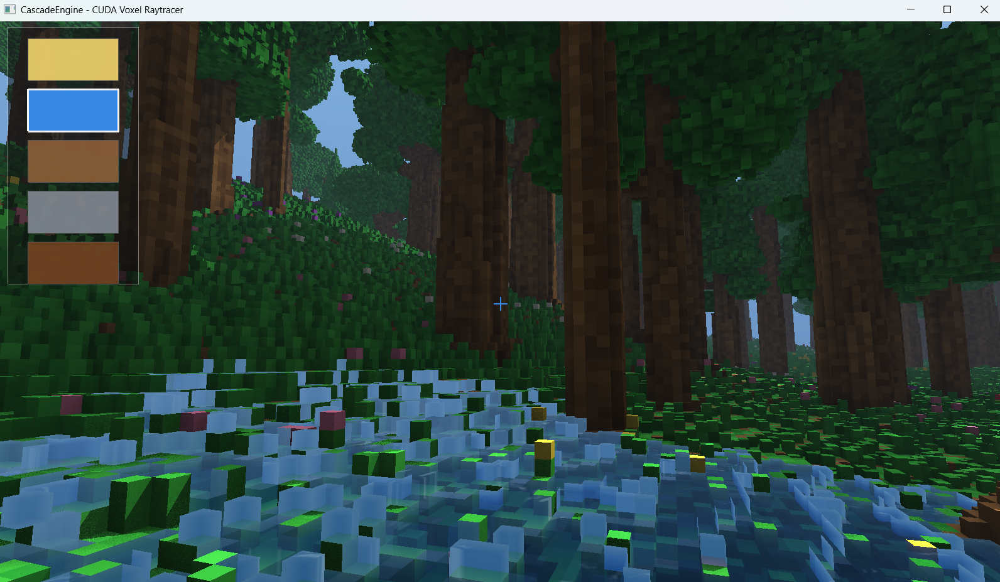
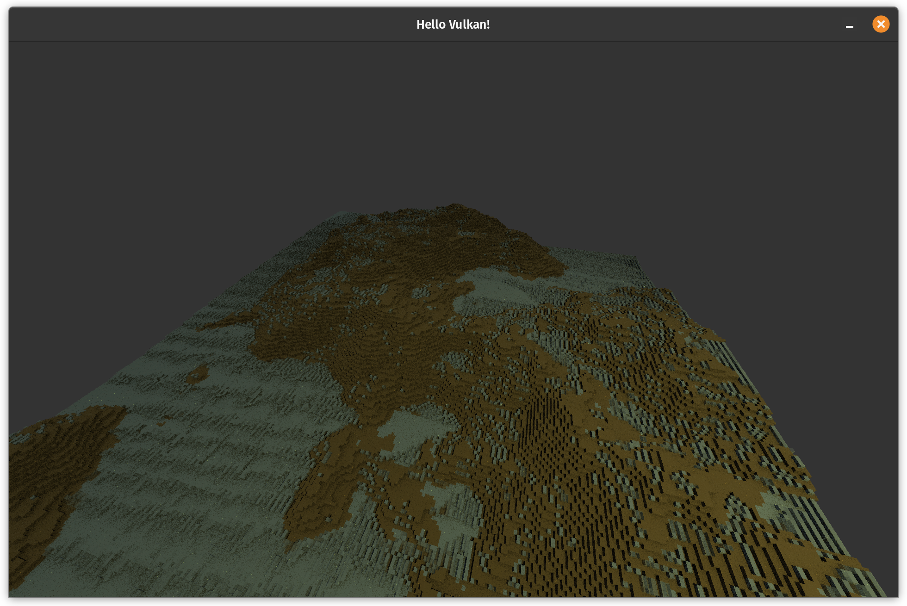
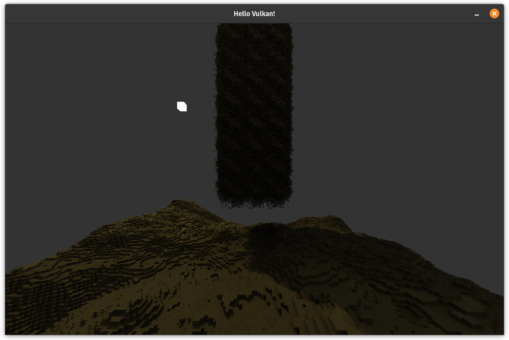
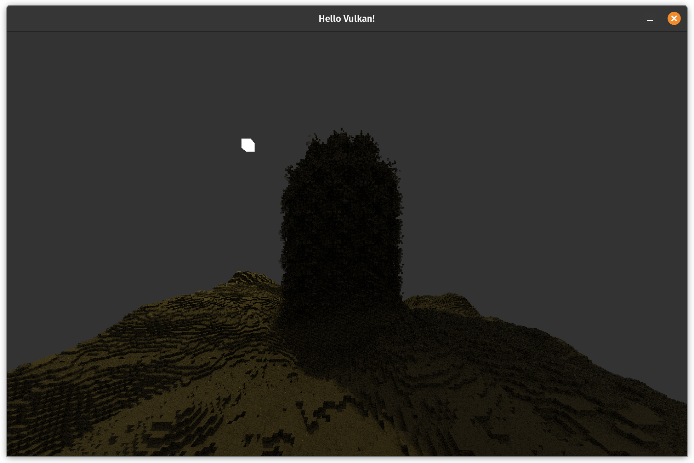
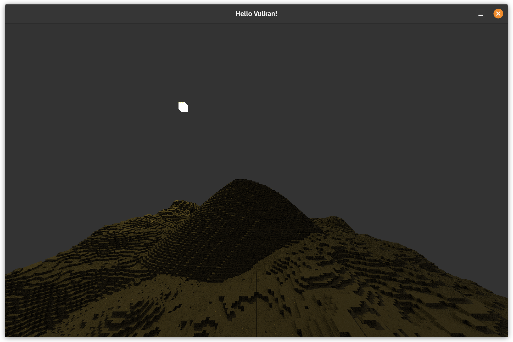

# Note: Code is outdated
Latest changes are local (pending cleanup and port from cuda to gpu agnostic libraries). Progress:

# CascadeEngine
A WIP fully raytraced voxel game engine, with a focus on fast, dynamic worlds. Written from scratch in Vulkan.

__IMPORTANT: Latest work is on the raytracer-perf branch__

NOTE: The label of 'engine' is mostly aspirational as of now. It is not set up to be easily extensible, or really function like an engine should. Once the main features are there, i'd like to start moving in that direction.

## Showcase
Every voxel in the game world is updated each frame according to simple rules. Since this can involve updating 100s of billions of voxels per second, it is done in parallel on the GPU using a compute shader. Here is some of the behaviour that emerges.

Water is still a work in progress. Right now it's spread is too slow, causing water levels to equalize slower than feels natural.

Dropped sand settles into piles.

## Documentation

## Implementation
### Graphics Library and Pipeline
### Physics
### Raytracing

### Denoising
Right now, I use a number of denoising strategies:
- Blue noise
- Temporal accumulation with reprojection
- Edge-avoiding atrous wavelet filter

[#6](https://github.com/Jack-Rickwood/CascadeEngine/issues/6) contains some ideas for how i'd like to improve this process in the future.

### GUI
As of now, the config GUI is implemented very crudely using SFML / the tGUI library. What this means is that SFML creates a separate OpenGL context that runs in parallel alongside the main Vulkan application. This is not ideal, but I couldn't think of an alternative that wouldn't have required rewriting my rendering code to use a traditional Vulkan graphics pipeline. The current GUI is mostly a bandaid solution to allow me to quickly tweak settings, and will ideally be replaced in the future.

## Roadmap

## References
